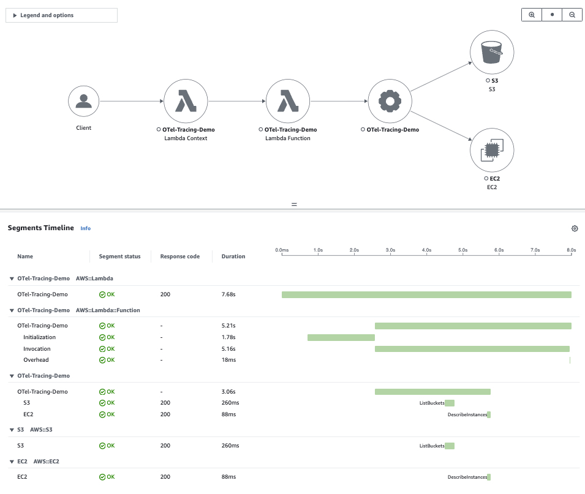
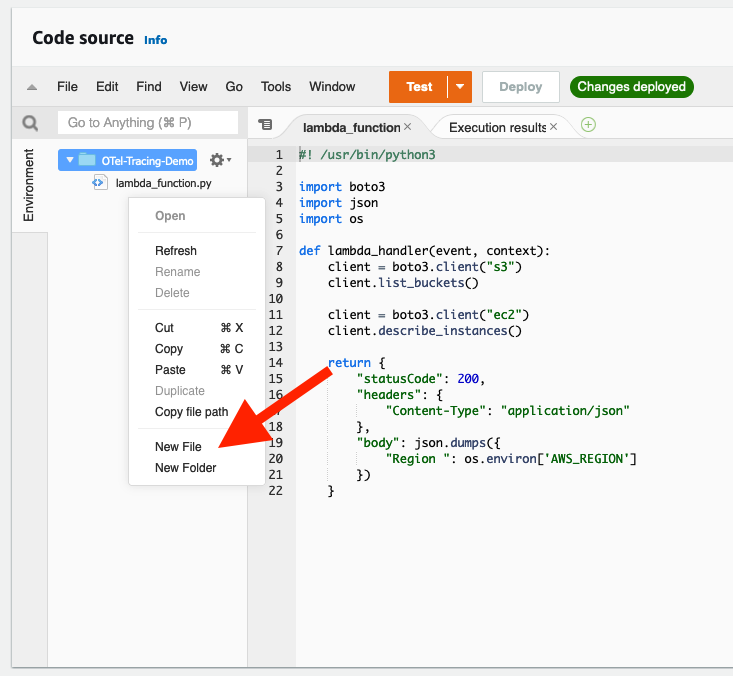

# Auto-instrumenting a Python application with an AWS Distro for OpenTelemetry Lambda layer

## Getting started

1. Create AWS Lambda and select **Author from scratch.**

    - **Name:** OTel-Tracing-Demo
    - **Runtime:** Python 3.8
    - **Architecture:** x86_64
    - **Architecture:** x86_64

2. Add the following **inline policy** to the Lambda IAM role. | Name: **CallOtherAWSServicesDemo**

    ```json
    {
        "Version": "2012-10-17",
        "Statement": [
            {
                "Sid": "VisualEditor0",
                "Effect": "Allow",
                "Action": [
                    "ec2:DescribeInstances",
                    "s3:ListAllMyBuckets"
                ],
                "Resource": "*"
            }
        ]
    }
    ```

3. When the window opens to the Lambda code editor, you can replace the starter code with the following Lambda handler code. Make sure to select Deploy after any changes.

    ```python
    #! /usr/bin/python3

    import boto3
    import json
    import os

    def lambda_handler(event, context):
        client = boto3.client("s3")
        client.list_buckets()
        
        client = boto3.client("ec2")
        client.describe_instances()

        return {
            "statusCode": 200,
            "headers": {
                "Content-Type": "application/json"
            },
            "body": json.dumps({
                "Region ": os.environ['AWS_REGION']
            })
        }
    ```

4. Adding the AWS Distro for OpenTelemetry Lambda layer to the Lambda function | **Select Add a layer** => **Specify an ARN**

    - [AWS Distro for OpenTelemetry Lambda Support For Python](https://aws-otel.github.io/docs/getting-started/lambda/lambda-python)
    - ARN: arn:aws:lambda:us-east-1:901920570463:layer:aws-otel-python-amd64-ver-1-20-0:2

5. Enable Active tracing in Lambda **Configuration** => **Monitoring and operations tools** => **Edit**

6. Add variables in **Configuration** => **Environment variables** => **Edit**

    | Key                                            | Value                        |
    | ---------------------------------------------- | ---------------------------- |
    | AWS_LAMBDA_EXEC_WRAPPER                        | /opt/otel-instrument         |

7. Save Environment variables.

8. Nine seconds should be enough. **Configuration** => **General configuration** => **Edit** => Change **Timeout** to 9 seconds.

9. We run a test, and in AWS XRay, we can see traces as shown in the following image.

    

## With Collector file

1. Add ne file with name **collector.yaml**

    

    ```yaml
    # collector.yaml in the root directory
    # Set an environemnt variable 'OPENTELEMETRY_COLLECTOR_CONFIG_FILE' to
    # '/var/task/collector.yaml'

    receivers:
    otlp:
        protocols:
        grpc:
        http:

    exporters:
    logging:
        loglevel: debug
    # awsxray:

    #enables output for traces to xray
    service:
    pipelines:
        traces:
        receivers: [otlp]
        exporters: [logging]
    ```

2. Add variables in **Configuration** => **Environment variables** => **Edit**

    | Key                                            | Value                        |
    | ---------------------------------------------- | ---------------------------- |
    | AWS_LAMBDA_EXEC_WRAPPER                        | /opt/otel-instrument         |
    | OPENTELEMETRY_COLLECTOR_CONFIG_FILE            | /var/task/collector.yaml     |

3. If we add a collector file, it will look like the following image.
