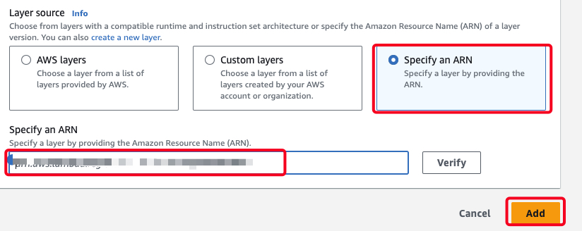

# Otel AWS Lambda Auto-Instrumentation | NodeJS16x With LightStep

## Getting started

- Pre-requisites
  - An account on -> [LightStep](https://app.lightstep.com/)

1. Create AWS Lambda

    

2. Create with config.
    - **Author from scratch**
    - **Function name:** LambdaFunctionNodeJs16x-Lightstep
    - **Runtime:** Node.js 16.x

3. Add Layer on Lambda.
    - In the tab **code** on section **Layers**
    - Click on Add a layer.

    

    - Select **Specify an ARN**, enter the arn from Node.js 16.x. See Reference Link.

    

4. Add **Environment variables**
    - In the tab **Configuration** on section **Environment variables**
    - Click on **Edit**.

    | Key                                  | Value                                   |
    | ------------------------------------ | --------------------------------------- |
    | AWS_LAMBDA_EXEC_WRAPPER              | /opt/otel-handler                       |
    | OPENTELEMETRY_COLLECTOR_CONFIG_FILE  | /var/task/opentelemetry/collector.yaml  |
    | LIGHTSTEP_ACCESS_TOKEN               | < token-lightstep >                     |

    - Dato: Tambien se puede agregar s3://<"bucket_name">.s3.<"region">.amazonaws.com/collector_config.yaml

5. Add **New Folder** => opentelemetry => Add **New Folder** => collector.yaml

```
#collector.yaml in the any directory below your src root directory
receivers:
  otlp:
    protocols:
      grpc:
        endpoint: localhost:4317
      http:
        endpoint: localhost:4318

exporters:
  logging:
    loglevel: debug

  awsxray:

  # configuring otlp to Lightstep public satellites
  otlp/lightstep:
    endpoint: ingest.lightstep.com:443
    headers:
      "lightstep-access-token": "${LIGHTSTEP_ACCESS_TOKEN}"

service:
  pipelines:
    traces:
      receivers: [otlp]
      exporters: [logging, otlp/lightstep]
```

6. Add **Traces** | OPTIONAL
    - In the tab **Configuration** on section **Monitoring and operations tools**
    - Click on **Edit**.
    - Enable **Active tracing**

7. Validation
    - In the tab **Test**
    - Click on **Test**

    

## Referencias

- [ ] [Find the most recent instrumentation layer release](https://github.com/open-telemetry/opentelemetry-lambda/releases)
- [ ] [OPENTELEMETRY FOR AWS LAMBDA SERVERLESS FUNCTIONS](https://github.com/dimitrisfinas/opentelemetry-aws/tree/main/lambda)
- [ ] [Instrument Lambda with OpenTelemetry - Youtube](https://www.youtube.com/watch?v=iycLNwmpcOQ&list=PLDU53smEPE5yHMgLHjwo6_gs9WtNXRgcj&index=15)
