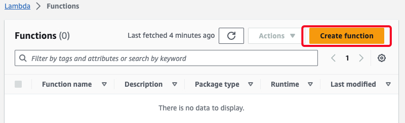
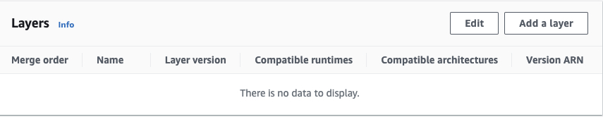
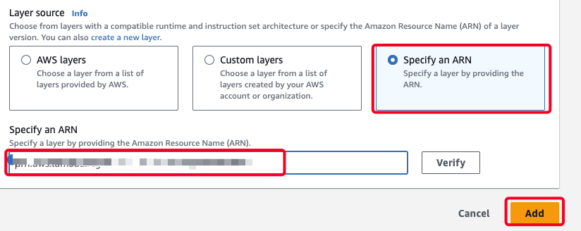
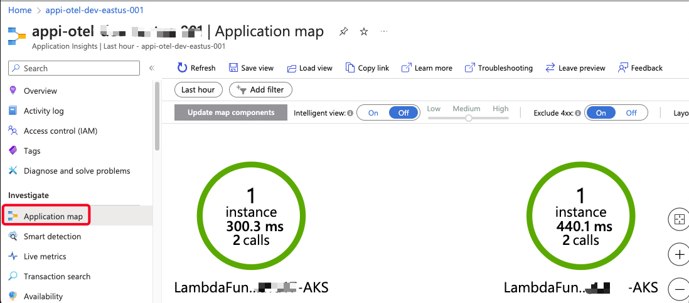

# Otel AWS Lambda Auto-Instrumentation | Node.js 16.x

## Getting started

1. Create AWS Lambda

    

2. Create with config.
    - **Author from scratch**
    - **Function name:** LambdaFunctionNodeJS16-AKS
    - **Runtime:** Node.js 16.x

3. Add Layer on Lambda.
    - In the tab **code** on section **Layers**
    - Click on Add a layer.

    

    - Select **Specify an ARN**, enter the arn from Node.js 16.x. See Reference Link.

    

4. Add **Environment variables**
    - In the tab **Configuration** on section **Environment variables**
    - Click on **Edit**.

    | Key                                            | Value                        |
    | ---------------------------------------------- | ---------------------------- |
    | AWS_LAMBDA_EXEC_WRAPPER                        | /opt/otel-handler            |
    | OTEL_EXPORTER_OTLP_ENDPOINT                    | http://20.96.246.125:4318    |
    | OTEL_EXPORTER_OTLP_PROTOCOL                    | http/protobuf                |

5. Add **Traces** | OPTIONAL
    - In the tab **Configuration** on section **Monitoring and operations tools**
    - Click on **Edit**.
    - Enable **Active tracing**

6. Validation.
    - In the tab **Test**
    - Click on **Test**

    

## Referencias

- [ ] [Find the most recent instrumentation layer release](https://github.com/open-telemetry/opentelemetry-lambda/releases)
